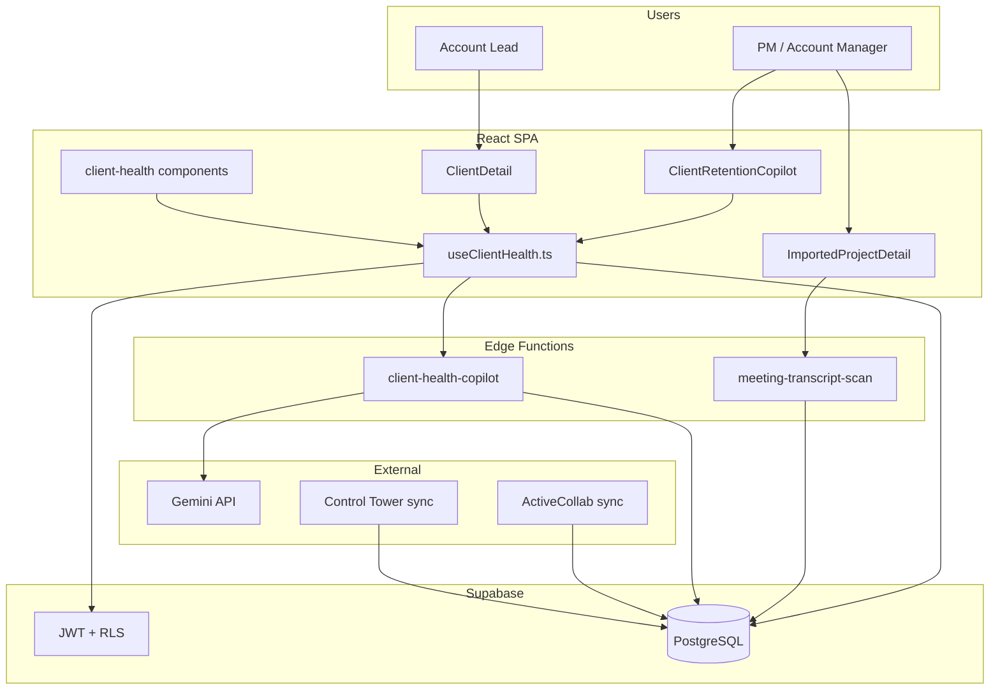
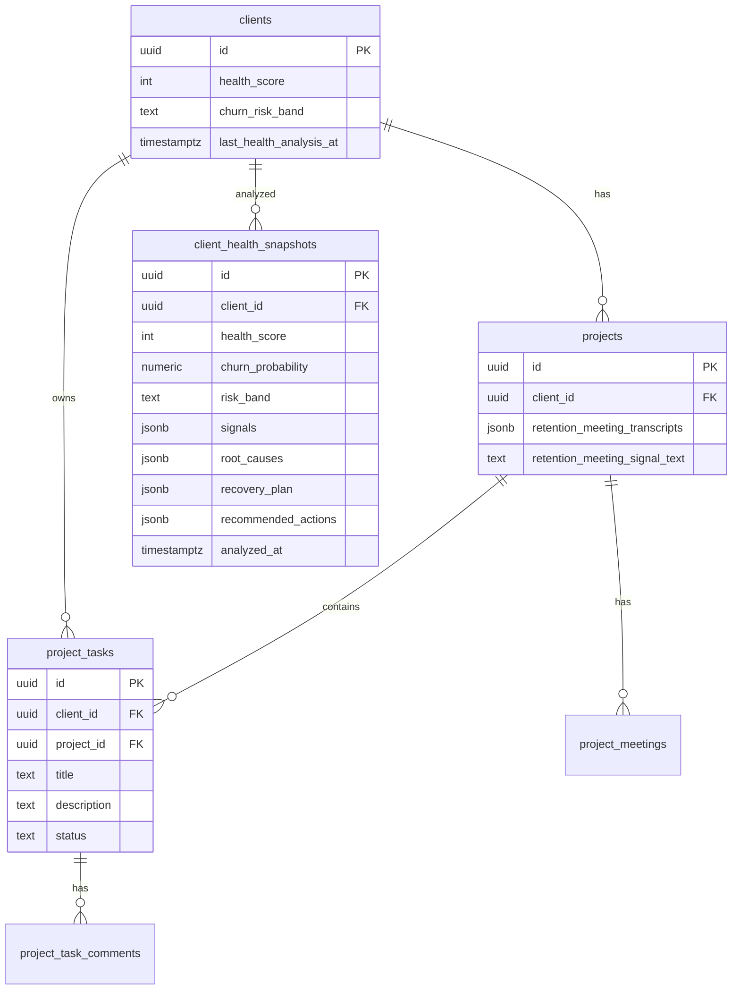
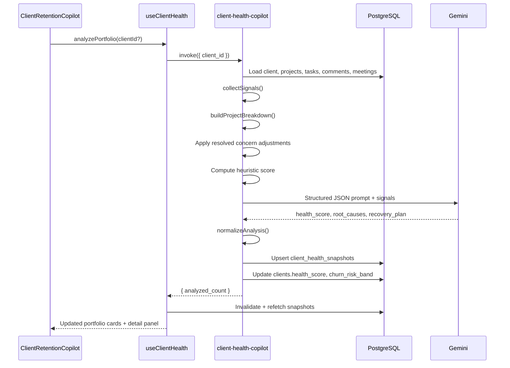
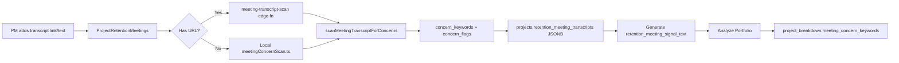
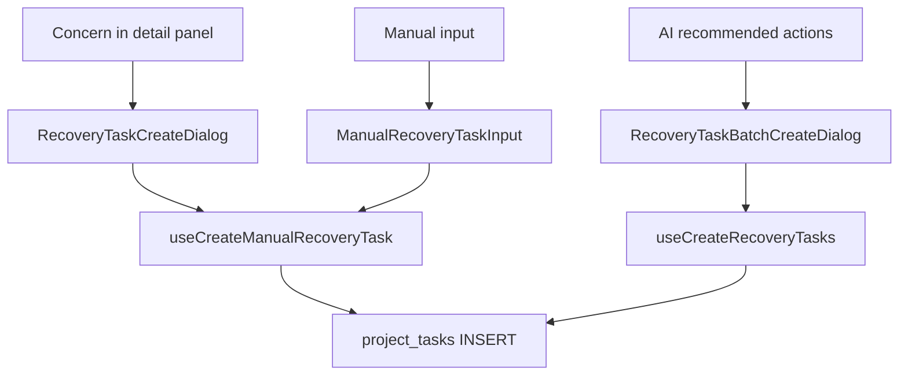
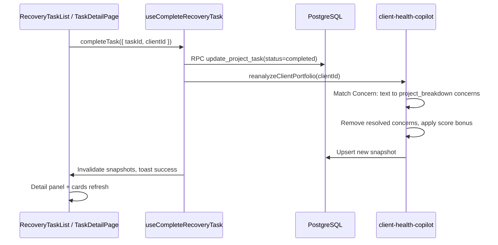
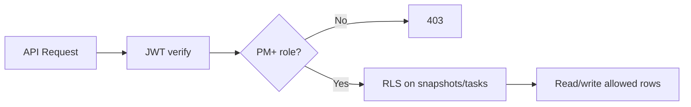

# AI Client Retention Copilot — Architecture Document

> **Last Updated:** 2026-07-03  
> **Status:** Active — reflects production codebase  
> **Audience:** Engineers, architects, technical leads  
> **Related:** [Feature overview](./client-retention-copilot.md) · [Platform architecture](../marketing-control-tower-architecture.md) · [Business overview](../marketing-control-tower-business-overview.md)

---

## 1. Executive summary

The **AI Client Retention Copilot** is a PM-facing module that monitors client delivery health across the portfolio, predicts churn risk, and drives recovery actions. It aggregates signals from **ActiveCollab**, **Control Tower**, task comments, and meeting transcripts — then runs a **heuristic scoring engine** plus **Google Gemini** analysis to produce actionable health snapshots.

**Core question answered:** *Is this client at risk, why, on which projects, and what should we do next?*

| Attribute | Value |
|-----------|-------|
| Primary route | `/client-retention-copilot` |
| Minimum role | `pm` |
| Main edge function | `client-health-copilot` |
| AI provider | Google Gemini |
| State management | TanStack Query v5 |
| Persistence | `client_health_snapshots` + denormalized `clients` fields |

---

## 2. System context



### Scope boundaries

| In scope | Out of scope (by design) |
|----------|--------------------------|
| ActiveCollab tasks (`activecollab_task_id`) | HubSpot CRM fields |
| Control Tower tasks | Google Analytics / Search Console |
| Task comments (`project_task_comments`) | Slack / Microsoft Teams |
| Project deadlines & task due dates | Invoice / billing data |
| Retention meeting transcripts (JSONB) | `client_communications` (legacy) |
| Recovery task lifecycle | |

---

## 3. Architectural principles

| Principle | Implementation |
|-----------|----------------|
| **Analyze on demand** | Portfolio scan triggered by user; no background cron in v1 |
| **Evidence-first scoring** | Heuristic rules run before AI; signals stored in snapshot JSONB |
| **Project-granular concerns** | `project_breakdown[]` groups risks per delivery unit |
| **Recovery closes the loop** | Completed recovery tasks resolve linked concerns and trigger re-analysis |
| **PM-gated access** | Route + RLS + edge function role checks |
| **Memory-safe transcript fetch** | `meeting-transcript-scan` streams up to 200KB |

---

## 4. Layer architecture

### 4.1 Presentation layer

```
src/
├── pages/
│   ├── ClientRetentionCopilot.tsx      # Portfolio dashboard
│   └── ClientDetail.tsx                # Retention Portfolio + Run Analysis CTAs
├── components/
│   ├── client-health/
│   │   ├── ClientHealthCard.tsx        # Portfolio card per client
│   │   ├── ClientHealthDetailPanel.tsx # Side sheet with full analysis
│   │   ├── ClientProjectConcerns.tsx   # Project-wise concerns + create recovery task
│   │   ├── RecoveryActionBar.tsx       # AI recommended actions
│   │   ├── RecoveryTaskCreateDialog.tsx
│   │   ├── RecoveryTaskBatchCreateDialog.tsx
│   │   ├── RecoveryTaskList.tsx
│   │   ├── RecoveryTasksPortfolio.tsx
│   │   ├── HealthPortfolioSummary.tsx
│   │   └── RetentionCopilotSignalsSummary.tsx
│   └── projects/
│       ├── ProjectClientPortfolioPanel.tsx  # Project ↔ client ↔ portfolio links
│       └── ProjectRetentionMeetings.tsx     # Meeting transcript input + scan
├── hooks/
│   └── useClientHealth.ts              # Snapshots, analysis, recovery tasks
└── lib/
    ├── clientSlugUtils.ts              # getClientRetentionCopilotUrl()
    ├── meetingConcernScan.ts           # Frontend concern keyword scan
    └── retentionMeetingText.ts         # Generate retention_meeting_signal_text
```

**Routing** (`src/App.tsx`):

| Route | Component | Role |
|-------|-----------|------|
| `/client-retention-copilot` | `ClientRetentionCopilot` | PM+ |
| `/client-retention-copilot?client=<uuid>` | Same (auto-opens detail panel) | PM+ |
| `/clients/:slug` | `ClientDetail` | PM+ |
| `/projects/:slug/details` | `ImportedProjectDetail` (Meetings tab) | PM+ |

### 4.2 Application layer (edge functions)

| Function | Path | Purpose |
|----------|------|---------|
| `client-health-copilot` | `supabase/functions/client-health-copilot/index.ts` | Signal collection, scoring, Gemini analysis, snapshot persistence |
| `meeting-transcript-scan` | `supabase/functions/meeting-transcript-scan/index.ts` | Fetch transcript URL (streamed), scan for concern keywords |

**Shared utilities:**

| File | Purpose |
|------|---------|
| `_shared/meeting-concern-scan.ts` | Keyword scan, HTML strip, flag generation |
| `_shared/auth-guard.ts` | JWT + role verification (`requireRole`) |
| `_shared/cors.ts` | CORS headers |

### 4.3 Data layer



**Key JSONB structures:**

`projects.retention_meeting_transcripts` — array of meeting rows:

```json
{
  "title": "Weekly sync",
  "meeting_date": "2026-03-15",
  "transcript_link": "https://...",
  "generated_text": "...",
  "concern_keywords": ["disappointed", "overdue"],
  "concern_flags": ["Keyword \"disappointed\" in transcript"],
  "has_client_concerns": true
}
```

`client_health_snapshots.signals.project_breakdown[]` — per-project analysis:

```json
{
  "project_id": "uuid",
  "project_name": "Student Onboarding Portal",
  "overdue_count": 2,
  "meeting_concern_keywords": ["disappointed", "frustrated"],
  "concerns": ["2 overdue task(s) — e.g. \"SSO handoff\""],
  "resolved_concern_count": 1
}
```

---

## 5. Analysis pipeline



### 5.1 Signal collection (`collectSignals`)

1. Load client record and all linked projects
2. Merge `project_tasks` by `project_id` and `client_id`
3. Classify tasks: open, overdue, stale (14+ days), approaching (7-day window)
4. Load recent `project_task_comments`; flag negative keywords
5. Parse `retention_meeting_transcripts` and `project_meetings`
6. Build `project_breakdown[]` with per-project `concerns[]`
7. Match **completed recovery tasks** to concerns via `Concern:` marker in description
8. Compute heuristic score with penalties and resolved-concern bonuses
9. Pass compact signals to Gemini; persist normalized result

### 5.2 Heuristic scoring

**Base:** `clients.satisfaction_score` (default 85)

| Condition | Adjustment |
|-----------|------------|
| Each overdue open task | −5 (max −25) |
| Each stale open task | −10 (max −20) |
| No meeting touch in 21+ days | −15 |
| Negative comment flags | −5 each (max −15) |
| Meeting negative flags | −5 each (max −15) |
| Meeting concern keywords (unresolved) | −4 each (max −20) |
| 3+ tasks due within 7 days | −5 |
| Each resolved concern (completed recovery task) | +6 (max +30) |

Score clamped to 0–100. Fed to Gemini as context; AI may adjust final output.

### 5.3 Risk bands

| Band | Typical score | Churn window |
|------|---------------|--------------|
| `healthy` | 85+ | 90 days |
| `stable` | 70–84 | 90 days |
| `watch` | 50–69 | 90 days |
| `critical` | 30–49 | 45 days |
| `immediate` | <30 | 30 days |

---

## 6. Meeting concern pipeline



**Tracked keywords** (sample): `disappointed`, `frustrated`, `overdue`, `missed deadline`, `complaint`, `cancel`, `refund`, `escalate`, `sue`, `lawsuit`.

Scan logic is duplicated intentionally:
- **Edge:** `supabase/functions/_shared/meeting-concern-scan.ts`
- **Frontend:** `src/lib/meetingConcernScan.ts` (cannot import from Deno paths)

---

## 7. Recovery task architecture

Recovery tasks are standard `project_tasks` rows tagged for the copilot workflow.

### 7.1 Identification

| Marker | Value |
|--------|-------|
| Title prefix | `[Recovery]` |
| Description footer | `Source: client-retention-copilot` |
| Concern link | `Concern: <exact concern text>` at top of description |

**Constants** (`src/hooks/useClientHealth.ts`):

```typescript
RECOVERY_TASK_SOURCE = "client-retention-copilot"
RECOVERY_TITLE_PREFIX = "[Recovery]"
```

### 7.2 Creation flows



User can edit **task name** and **details** before create in both dialog flows.

### 7.3 Completion → score revision



**Completion entry points:**

| Location | Hook |
|----------|------|
| Recovery task list (detail panel) | `useCompleteRecoveryTask` |
| Task detail page (`/tasks/:id`) | `useUpdateProjectTask` → `reanalyzeClientPortfolio` if recovery task |

---

## 8. Frontend state management

### 8.1 Query keys

| Key | Data |
|-----|------|
| `client-health-snapshots` | Latest snapshot per client (portfolio view) |
| `recovery-tasks` | Recovery tasks (optional client filter) |
| `recovery-tasks-summary` | Pending/ongoing/completed counts per client |

### 8.2 Key hooks (`useClientHealth.ts`)

| Hook / function | Purpose |
|---------------|---------|
| `useClientHealth()` | Portfolio snapshots + `analyzePortfolio()` |
| `useRecoveryTasks()` | List recovery tasks with status filter |
| `useRecoveryTasksPortfolio()` | All recovery tasks grouped by client |
| `useCreateManualRecoveryTask()` | Single task from concern or manual input |
| `useCreateRecoveryTasks()` | Batch from AI recommended actions |
| `useCompleteRecoveryTask()` | Complete + re-analyze client |
| `reanalyzeClientPortfolio()` | Direct edge function invoke |

### 8.3 Cache invalidation

On analysis complete or recovery task mutation:

- `client-health-snapshots`
- `recovery-tasks`, `recovery-tasks-summary`
- `project-tasks`, `all-project-tasks`

`ClientRetentionCopilot` syncs `selectedSnapshot` when snapshots refetch so the detail panel shows updated scores.

---

## 9. Security & authorization



| Layer | Control |
|-------|---------|
| Route | `<ProtectedRoute requiredMinimumRole="pm">` |
| Edge function | `requireRole(supabase, "pm")` |
| `client_health_snapshots` | SELECT for pm, manager, super_admin |
| Task mutations | `update_project_task` RPC with permission checks |

---

## 10. AI integration

| Setting | Value |
|---------|-------|
| Provider | Google Gemini |
| Secret | `GEMINI_API_KEY` (Supabase edge function secret) |
| Output format | Structured JSON |
| Fallback | Heuristic-only analysis if Gemini unavailable |

**AI prompt inputs:**
- Heuristic score and raw signal counts
- `project_breakdown[]` with active (unresolved) concerns
- `recovery_tasks.resolved_concerns[]` for completed recovery work
- Meeting excerpts and negative comment flags

**AI outputs (normalized):**
- `health_score`, `churn_probability`, `churn_window_days`, `risk_band`
- `headline`, `explanation`
- `root_causes[]`, `recovery_plan[]`, `recommended_actions[]`

---

## 11. Deployment

```bash
# Database
supabase db push
# If migrations out of order:
supabase db push --include-all

# Edge functions
supabase functions deploy client-health-copilot
supabase functions deploy meeting-transcript-scan

# Secrets (Supabase dashboard or CLI)
# GEMINI_API_KEY=<your-key>
```

**Verification checklist:**

1. Log in as PM+ (`demo.admin@sjinnovation.com`)
2. Navigate to `/client-retention-copilot`
3. Click **Analyze Portfolio**
4. Open a client detail panel — verify concerns, recovery tasks, recommended actions
5. Create recovery task from a concern → complete → confirm score updates

---

## 12. Key file reference

| Area | File |
|------|------|
| Portfolio page | `src/pages/ClientRetentionCopilot.tsx` |
| Data hook | `src/hooks/useClientHealth.ts` |
| Analysis engine | `supabase/functions/client-health-copilot/index.ts` |
| Transcript scan | `supabase/functions/meeting-transcript-scan/index.ts` |
| Concern scan logic | `supabase/functions/_shared/meeting-concern-scan.ts` |
| Meeting UI | `src/components/projects/ProjectRetentionMeetings.tsx` |
| Project ↔ client nav | `src/components/projects/ProjectClientPortfolioPanel.tsx` |
| DB schema | `supabase/migrations/20260227000000_client_health_copilot.sql` |
| Meeting columns | `supabase/migrations/20260320210000_project_retention_meetings.sql` |

---

## 13. Extension points

| Future enhancement | Suggested approach |
|--------------------|-------------------|
| Scheduled portfolio scan | Supabase cron → invoke `client-health-copilot` with service role |
| Email draft actions | Wire `recommended_actions.type=draft_email` to `send-client-email` |
| Slack alerts | Edge function webhook on `immediate` / `critical` band |
| HubSpot enrichment | Optional read-only layer; keep out of core scoring v1 |
| Concern → task many-to-one | Add `concern_id` column or JSONB metadata on `project_tasks` |

---

## 14. Related documentation

- [Feature overview & operational guide](./client-retention-copilot.md)
- [Platform architecture](../marketing-control-tower-architecture.md)
- [Business overview](../marketing-control-tower-business-overview.md)
- [Integration points](../integration_points.md)
- [Database schema](../database_schema.md)
- Root [README.md](../../README.md) — retention analysis logic summary
