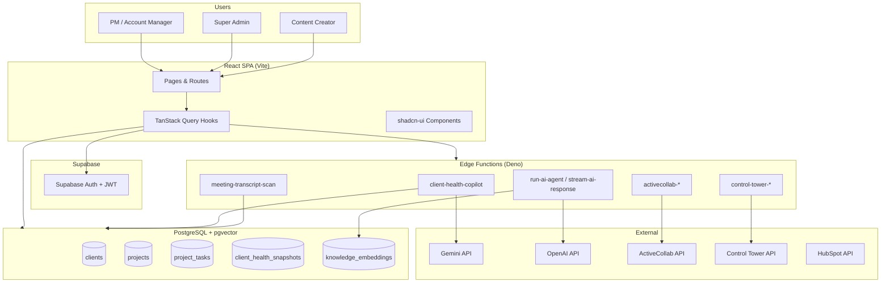
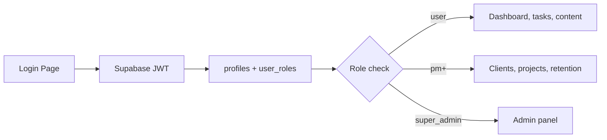
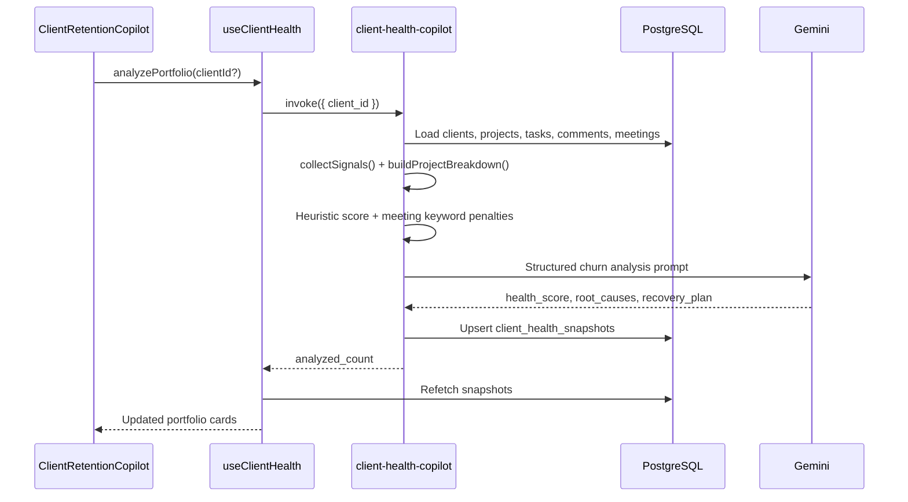
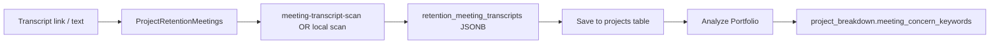
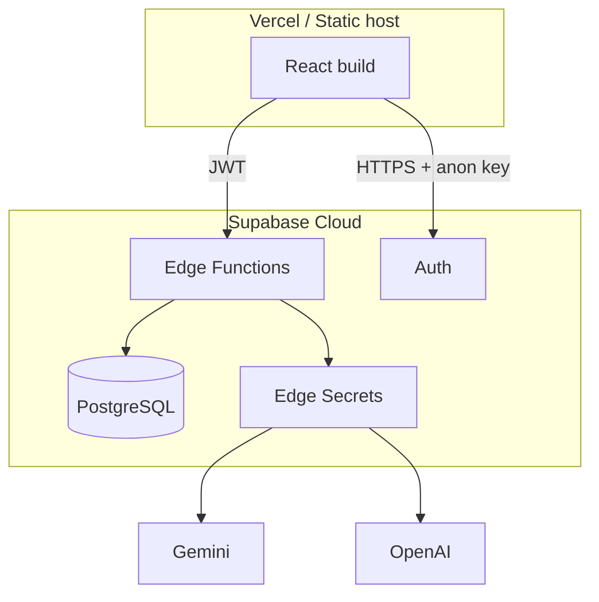

# Marketing Control Tower — Architecture Document

> **Last Updated:** 2026-03-20  
> **Status:** Active — reflects production codebase including Client Retention Copilot  
> **Audience:** Engineers, architects, technical leads

---

## 1. Executive summary

**SJ Marketing Control Tower** is an enterprise marketing operations platform for agencies. It unifies AI-powered content generation, client and project delivery management, knowledge bases, analytics integrations, and team collaboration behind a single React application backed by Supabase.

The platform follows a **modular monolith frontend + serverless backend** pattern:

- **Frontend:** React 18, TypeScript, Vite, TanStack Query, shadcn-ui
- **Backend:** Supabase PostgreSQL, Row Level Security, 85+ Deno Edge Functions
- **AI layer:** OpenAI, Google Gemini, Anthropic Claude, Perplexity — orchestrated via configurable agents and dedicated edge functions
- **Integrations:** ActiveCollab, Control Tower, HubSpot, Google Analytics, Google Drive, n8n, GoHighLevel

---

## 2. System context



---

## 3. Architectural principles

| Principle | Implementation |
|-----------|----------------|
| **Server state in React Query** | All API/Supabase reads via custom hooks; cache invalidation on mutations |
| **Security at the database** | RLS policies on sensitive tables; edge functions verify JWT + role |
| **Feature-oriented frontend** | `src/pages/`, `src/components/`, `src/hooks/` grouped by domain |
| **Serverless backend** | One edge function per capability; shared utilities in `_shared/` |
| **Streaming for AI** | Long responses via `stream-ai-response`, `linkedin-chat-stream` |
| **Memory-safe edge functions** | Stream large files; never load full transcripts into memory at once |

---

## 4. Layer architecture

### 4.1 Presentation layer (`src/`)

```
src/
├── pages/              # Route-level screens
│   ├── ClientRetentionCopilot.tsx
│   ├── ClientDetail.tsx
│   ├── ProjectManagement.tsx
│   ├── ImportedProjectDetail.tsx
│   ├── adminpanel/     # Super admin control panel
│   └── content/        # LinkedIn, SEO, newsletter
├── components/         # Reusable UI
│   ├── client-health/  # Retention copilot UI
│   ├── projects/       # Project cards, meetings, portfolio panel
│   └── ui/             # shadcn primitives
├── hooks/              # Data fetching & mutations
│   ├── useClientHealth.ts
│   ├── useProjects.tsx
│   └── useAuth.tsx
├── lib/                # Pure utilities
│   ├── retentionMeetingText.ts
│   ├── meetingConcernScan.ts
│   └── clientSlugUtils.ts
└── integrations/supabase/
    ├── client.ts       # Supabase singleton
    └── types.ts        # Auto-generated DB types
```

**Routing:** React Router v6 with role-gated `<ProtectedRoute>` wrappers (`requiredMinimumRole="pm"` for clients/projects/retention).

**Dev server:** `0.0.0.0:8080` (Vite).

### 4.2 Application / API layer (`supabase/functions/`)

Edge functions are Deno modules deployed independently. Categories:

| Category | Examples |
|----------|----------|
| **Client retention** | `client-health-copilot`, `meeting-transcript-scan` |
| **Project sync** | `activecollab-projects`, `activecollab-tasks`, `control-tower-projects` |
| **AI agents** | `run-ai-agent`, `stream-ai-response`, `linkedin-content` |
| **Knowledge** | `knowledge-base-upload`, `index-brand-knowledge`, `process-knowledge-jobs` |
| **Admin** | `admin-users`, `integration-health-check` |

Shared code: `supabase/functions/_shared/` (`cors.ts`, `auth-guard.ts`, `meeting-concern-scan.ts`, `openai-client.ts`).

### 4.3 Data layer (PostgreSQL)

- **115+ tables** with RLS
- **pgvector** for semantic search (`knowledge_embeddings`, `brand_knowledge_embeddings`, `agent_memories`)
- **JSONB** for flexible structures (`projects.retention_meeting_transcripts`)

Key retention-related tables:

| Table | Role |
|-------|------|
| `clients` | Client master; `health_score`, `churn_risk_band` |
| `projects` | Delivery unit; links to client; meeting transcripts JSONB |
| `project_tasks` | Tasks from ActiveCollab or Control Tower |
| `project_task_comments` | Comment threads on tasks |
| `client_health_snapshots` | Persisted AI analysis results |
| `project_tasks` (recovery) | `[Recovery]` tasks from copilot recommendations |

---

## 5. Authentication & authorization



**Role hierarchy (low → high):** `user` → `pm` → `brand_manager` → `manager` → `super_admin`

**Implementation:**
- Frontend: `useAuth()` → `hasRole()`, `hasMinimumRole()`
- Edge functions: `requireRole()` from `_shared/auth-guard.ts`
- Database: RLS policies per table

---

## 6. Core domain modules

### 6.1 Client & project delivery

- **Clients** (`/clients`, `/clients/:slug`) — CRM-lite client records, contacts, deals, projects tab
- **Projects** (`/projects`) — Imported ActiveCollab / Control Tower projects
- **Project detail** (`/projects/:slug/details`) — Tasks, meetings, knowledge, agents
- **Cross-navigation:** `ProjectClientPortfolioPanel` links project ↔ client ↔ retention portfolio

### 6.2 Client Retention Copilot

Primary route: `/client-retention-copilot` (PM+).



**Signal collection (`collectSignals`):**
1. Load all projects for client
2. Load `project_tasks` + `project_task_comments`
3. Compute overdue, stale, approaching-deadline tasks
4. Parse `retention_meeting_transcripts` for concern keywords
5. Build `project_breakdown[]` with per-project concerns
6. Apply heuristic score adjustments (including meeting keyword penalty)
7. Call Gemini for narrative analysis + recovery recommendations
8. Persist to `client_health_snapshots`

**Meeting concern pipeline:**



### 6.3 AI content & knowledge

- **LinkedIn content** — Leader-specific agents with brand knowledge RAG
- **SEO blog generator** — Keyword research + long-form generation
- **Knowledge base** — Upload, chunk, embed (OpenAI text-embedding-3-small, 1536 dims)
- **Brand workspace** — Per-brand public pages and AI tools

### 6.4 Integrations

| Integration | Sync direction | Storage |
|-------------|----------------|---------|
| ActiveCollab | Inbound | `projects`, `project_tasks` (encrypted credentials) |
| Control Tower | Inbound | `projects`, `control_tower_demo_projects` |
| HubSpot | Inbound | `clients`, contacts, deals |
| Google Analytics | Inbound | Brand metrics tables |
| Google Drive | OAuth + sync | Knowledge base files |

See [integration_points.md](./integration_points.md) for full detail.

---

## 7. Frontend state management

| Pattern | Use case |
|---------|----------|
| **TanStack Query** | Server data: clients, projects, health snapshots, tasks |
| **React Context** | Auth session (`useAuth`) |
| **Local state** | Forms, modals, UI toggles |
| **URL params** | `?client=<id>` on retention portfolio for deep links |

**Example — retention portfolio:**

```typescript
// useClientHealth.ts
useQuery({ queryKey: ["client-health-snapshots"], ... })
useMutation({ mutationFn: () => supabase.functions.invoke("client-health-copilot", { body }) })
```

---

## 8. Deployment topology



**Environments:**
- Local: `npm run dev` + optional `supabase functions serve`
- Production: Vercel frontend + Supabase project (`hcmaktizxypobvcfboez` or team project)

**Required secrets (retention):** `GEMINI_API_KEY`

**Deploy commands:**
```bash
supabase db push --include-all
supabase functions deploy client-health-copilot
supabase functions deploy meeting-transcript-scan
```

---

## 9. Security considerations

- JWT verification on protected edge functions
- PM+ role required for client/project/retention routes
- ActiveCollab credentials encrypted (AES-GCM) — see `activecollab-encryption-setup.md`
- RLS prevents cross-tenant data access
- Meeting transcript fetch capped at 200KB in `meeting-transcript-scan`
- No secrets in frontend bundle (only `VITE_SUPABASE_*` public keys)

---

## 10. Key file reference

| Concern | Path |
|---------|------|
| App routing | `src/App.tsx` |
| Retention portfolio page | `src/pages/ClientRetentionCopilot.tsx` |
| Health data hook | `src/hooks/useClientHealth.ts` |
| Meeting UI + auto-scan | `src/components/projects/ProjectRetentionMeetings.tsx` |
| Project-wise concerns UI | `src/components/client-health/ClientProjectConcerns.tsx` |
| Keyword scan logic | `src/lib/meetingConcernScan.ts` |
| Retention edge function | `supabase/functions/client-health-copilot/index.ts` |
| Transcript fetch/scan | `supabase/functions/meeting-transcript-scan/index.ts` |
| Shared scan utilities | `supabase/functions/_shared/meeting-concern-scan.ts` |

---

## 11. Related documentation

- [Business overview](./marketing-control-tower-business-overview.md)
- [Client Retention Copilot architecture](./features/client-retention-copilot-architecture.md)
- [Client Retention Copilot feature overview](./features/client-retention-copilot.md)
- [Database schema](./database_schema.md)
- [AI agent system](./ai_agent_system.md)
- [Integration points](./integration_points.md)
- Root [README.md](../../README.md)
