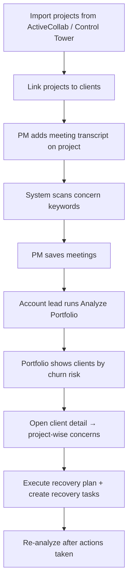
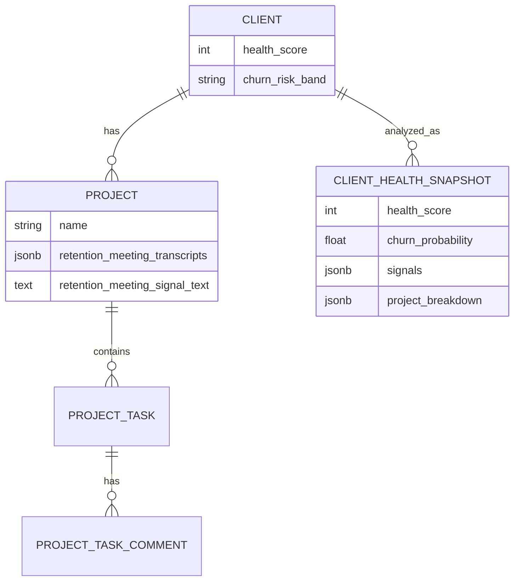

# Marketing Control Tower — Business Overview

> **Last Updated:** 2026-03-20  
> **Status:** Active  
> **Audience:** Product owners, account leaders, PMs, executives, onboarding

---

## 1. Product vision

**SJ Marketing Control Tower** is the operational command center for a modern marketing agency. It connects **client delivery**, **AI-assisted content production**, and **retention intelligence** in one platform so teams can:

- Deliver client work on time and with visibility
- Generate high-quality marketing content faster
- Detect churn risk before clients leave
- Act on recovery plans with clear ownership

**Tagline:** *Intelligence Dashboard + AI Task Hub*

**Deployed demo:** [hackathon-marketing-ct.vercel.app](https://hackathon-marketing-ct.vercel.app)

---

## 2. Problem statement

Marketing agencies struggle with:

| Problem | Impact |
|---------|--------|
| Delivery signals scattered across PM tools, meetings, and email | Account managers miss early warning signs |
| Reactive churn management | Revenue loss, firefighting, damaged reputation |
| Manual client status reporting | PM time wasted on spreadsheets and status calls |
| Content production bottlenecks | Slow turnaround on blogs, LinkedIn, SEO |
| No single view of client portfolio health | Leadership lacks portfolio-level risk visibility |

Marketing Control Tower addresses these by centralizing **delivery data**, **meeting intelligence**, and **AI analysis** into actionable client health scores and recovery workflows.

---

## 3. Target users & personas

### 3.1 Project Manager (PM)

- **Goals:** Track project delivery, tasks, deadlines; keep clients informed
- **Uses:** Projects, tasks, client detail, weekly email summaries
- **Retention role:** Adds meeting transcripts; reviews project-wise concerns

### 3.2 Account Manager / Client Success

- **Goals:** Protect revenue; prevent churn; maintain client relationships
- **Uses:** Client Retention Copilot, client detail, recovery tasks
- **Retention role:** Runs portfolio analysis; executes recovery plans

### 3.3 Content Creator / Strategist

- **Goals:** Produce LinkedIn posts, SEO blogs, newsletters efficiently
- **Uses:** Content library, brand workspaces, AI agents, knowledge base

### 3.4 Agency leadership (Manager / Super Admin)

- **Goals:** Portfolio visibility, team performance, integration health
- **Uses:** Admin panel, control tower, data sync, adoption analytics

### 3.5 General user

- **Goals:** Personal tasks, EOD submissions, assigned work
- **Uses:** Dashboard, My Tasks, EOD

---

## 4. Core business capabilities

### 4.1 Client & portfolio management

| Capability | Business value |
|------------|----------------|
| Client directory | Single source of truth for accounts |
| Client ↔ project linking | See all work for an account |
| HubSpot sync | Import CRM data without duplicate entry |
| Contacts & deals | Support sales-to-delivery handoff |

**Routes:** `/clients`, `/clients/:slug`

### 4.2 Project delivery hub

| Capability | Business value |
|------------|----------------|
| ActiveCollab import | Sync real project/task data |
| Control Tower import | Align with internal org structure |
| Task tracking | Overdue and stale work visible |
| Project knowledge base | Context for AI and team |

**Routes:** `/projects`, `/projects/:slug/details`

### 4.3 AI Client Retention Copilot

| Capability | Business value |
|------------|----------------|
| Portfolio health dashboard | All clients ranked by churn risk |
| Project-wise concerns | Pinpoint which project is at risk |
| Meeting transcript keywords | Capture client dissatisfaction from calls |
| AI recovery recommendations | Actionable next steps, not just scores |
| Recovery tasks | Convert recommendations into tracked work |

**Route:** `/client-retention-copilot`

### 4.4 AI content production

| Capability | Business value |
|------------|----------------|
| LinkedIn content generation | Leader-specific thought leadership at scale |
| SEO blog generator | Organic traffic content pipeline |
| Newsletter tools | Recurring client communications |
| Brand knowledge RAG | On-brand AI output |

### 4.5 Team operations

| Capability | Business value |
|------------|----------------|
| My Tasks | Personal and delegated work queue |
| EOD submissions | Daily accountability |
| Hackathon module | Internal innovation events |
| Weekly client email summary | Automated client updates |

---

## 5. Client Retention Copilot — business deep dive

### 5.1 Business question answered

> *"Which clients are at risk of churning, why, on which projects, and what should we do this week?"*

### 5.2 What data drives the score

The copilot intentionally uses **delivery and meeting signals** — evidence the agency controls — not vanity metrics.

| Signal source | What it tells the business |
|---------------|---------------------------|
| **ActiveCollab tasks** | Real delivery status from PM tool |
| **Control Tower tasks** | Internal task tracking |
| **Task comments** | Client/staff sentiment in writing |
| **Deadlines** | Overdue and approaching-due work |
| **Meeting transcripts** | Client language: disappointed, frustrated, overdue, sue, etc. |

**Explicitly excluded** (by product design): HubSpot fields alone, Google Analytics, Slack/Teams, invoice data. These may exist elsewhere but do not drive retention scoring to avoid false signals.

### 5.2.1 How analysis works (business view)

1. **Collect** — Pull all projects, tasks, comments, and meeting transcripts for the client
2. **Score per project** — Flag overdue work, stale tasks, negative comments, and meeting concern keywords **project by project**
3. **Rule-based score** — Apply penalties (e.g. overdue tasks −5 each, meeting keywords −4 each)
4. **AI review** — Gemini reads the full signal bundle and produces headline, root causes, and recovery plan
5. **Portfolio rank** — Clients sorted by churn risk; detail panel shows which **project** drove each concern

### 5.3 Risk bands

| Band | Health score | Churn probability | Business meaning |
|------|--------------|-------------------|------------------|
| **Healthy** | 85–100 | < 15% | Account stable; maintain cadence |
| **Stable** | 70–84 | 15–35% | Monitor; no urgent action |
| **Watch** | 50–69 | 35–60% | Schedule check-in; review delivery |
| **Critical** | 30–49 | 60–80% | Escalate to leadership; recovery plan |
| **Immediate** | 0–29 | > 80% | Urgent intervention; exec involvement |

### 5.4 Meeting concern keywords

When PMs add meeting transcript links or text on a project, the system scans for client-risk language:

- **Emotional:** disappointed, frustrated, unhappy, angry
- **Delivery:** overdue, missed deadline, delay, late
- **Escalation:** complaint, escalate, cancel, refund
- **Legal:** sue, lawsuit, legal action

Keywords are stored **per meeting**, rolled up **per project**, and factored into **portfolio health score** when analysis runs.

### 5.5 End-to-end business workflow

### 5.6 Demo scenario: EduTech Solutions

Seeded demo data includes **Student Onboarding Portal** with meeting concerns (disappointed, frustrated, missed deadline, overdue, sue) and overdue tasks — visible at:

`/projects/student-onboarding-portal/details` → Meetings tab

After **Analyze Portfolio**, EduTech appears with elevated risk and project-wise meeting keywords in the retention copilot.

---

## 6. Business domain model

**Key relationships:**
- One **client** has many **projects**
- Each **project** has tasks, comments, and optional meeting transcripts
- **Retention analysis** runs at client level but reports concerns **per project**

---

## 7. Navigation map (business view)

| User intent | Where to go |
|-------------|-------------|
| See all clients | `/clients` |
| View one client | `/clients/:slug` |
| Run retention analysis for one client | Client page → **Run Analysis** |
| See full portfolio risk | `/client-retention-copilot` |
| Import/sync projects | `/projects` |
| Add meeting concerns | `/projects/:slug/details` → Meetings |
| Jump from project to client | Project page → **Client & Portfolio** panel |
| Create recovery work | Retention detail panel → recovery actions |

---

## 8. Roles & access (business rules)

| Feature | Minimum role |
|---------|--------------|
| Dashboard, tasks, content | `user` |
| Clients, projects, retention copilot | `pm` |
| Admin panel, data sync, AI control | `super_admin` |

Demo credentials (password tab on login):

| Role | Email | Password |
|------|-------|----------|
| Admin | `demo.admin@sjinnovation.com` | `demo-password-123` |
| User | `demo.user@sjinnovation.com` | `demo-password-123` |

---

## 9. Success metrics (recommended KPIs)

| KPI | How the platform supports it |
|-----|------------------------------|
| **Churn rate** | Track clients moving from Stable → Critical over time |
| **Time to detect risk** | Days between meeting keyword flag and recovery action |
| **Recovery task completion** | `[Recovery]` tasks completed vs created |
| **Overdue task reduction** | Overdue count in `project_breakdown` before/after intervention |
| **Portfolio coverage** | % of clients with recent analysis (`last_health_analysis_at`) |
| **Meeting signal coverage** | % of active projects with saved meeting transcripts |

---

## 10. Product scope

### In scope (current)

- Client and project delivery tracking
- ActiveCollab + Control Tower import
- AI retention portfolio with project-wise concerns
- Meeting transcript keyword scanning
- Recovery task recommendations
- AI content generation (LinkedIn, SEO, newsletter)
- Knowledge base with vector search
- Hackathon, EOD, tasks, testimonials

### Out of scope (retention copilot)

- HubSpot-only risk scoring
- Google Analytics / Search Console as churn inputs
- Slack / Teams message ingestion
- Invoice / billing automation
- Automated email send on churn detection (recommendations only)

### Future opportunities

- Automated meeting transcript import from Zoom/Google Meet
- Client-facing health dashboards
- Trend charts (health score over time per client)
- Slack notifications when concern keywords detected
- CRM write-back (update HubSpot risk field from copilot)

---

## 11. Operational checklist

### For a new environment

1. Apply database migrations: `supabase db push --include-all`
2. Deploy edge functions: `client-health-copilot`, `meeting-transcript-scan`
3. Set `GEMINI_API_KEY` in Supabase secrets
4. Import or seed clients and projects
5. Log in as PM+ and run **Analyze Portfolio**

### For ongoing use

1. Keep ActiveCollab / Control Tower sync current
2. Add meeting transcripts after client calls
3. Re-run analysis weekly or after major delivery events
4. Assign and track recovery tasks

---

## 12. Related documentation

- [Architecture document](./marketing-control-tower-architecture.md)
- [Client Retention Copilot (technical)](./features/client-retention-copilot.md)
- [Project architecture (legacy deep dive)](./project_architecture.md)
- Root [README.md](../../README.md)
